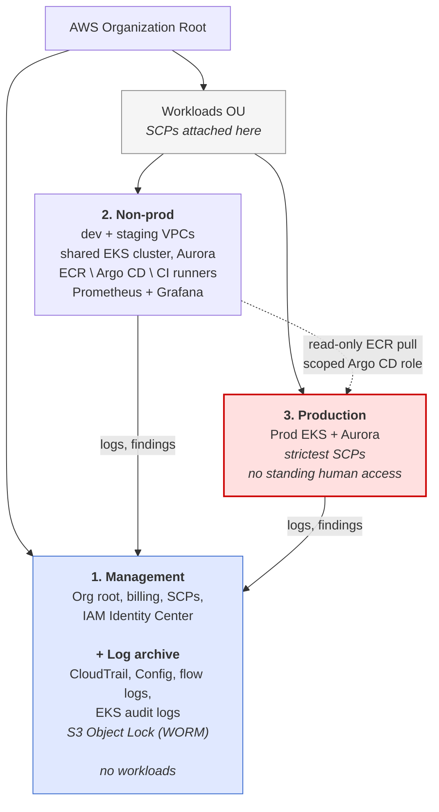
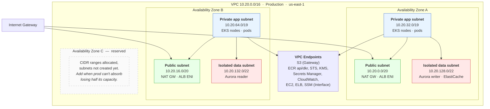
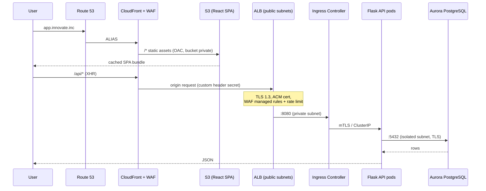
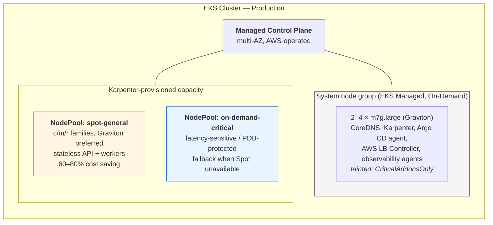
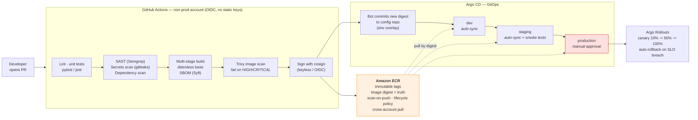
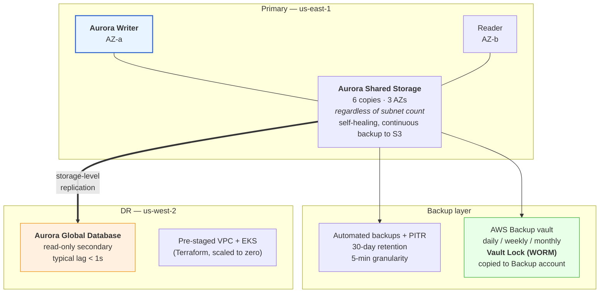
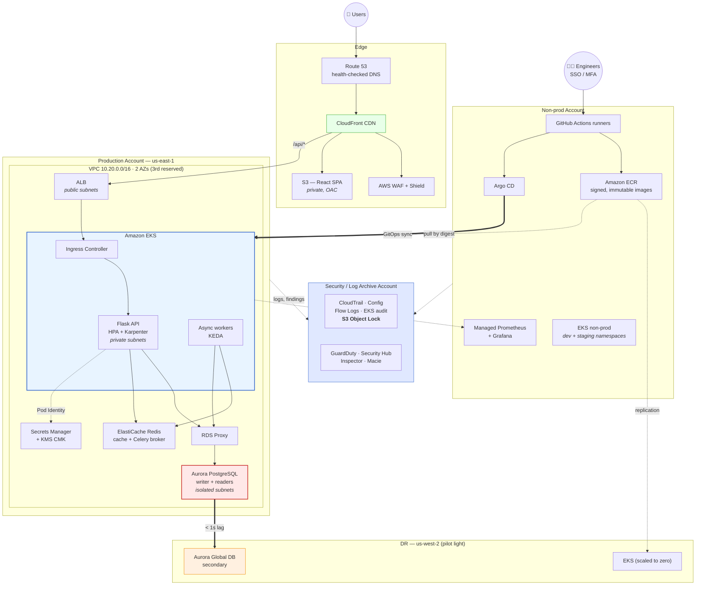

# Innovate Inc. - Cloud Architecture

**Cloud:** AWS · **Compute:** Amazon EKS · **Status:** proposed design, rolled out in phases

---

## 1. Summary

Innovate Inc. has a Flask API, a React SPA, and PostgreSQL. Traffic is tiny today but needs to grow to millions of users without rebuilding everything. The data is sensitive, and the team wants CI/CD from day one.

The plan: a small multi-account AWS Organization, two EKS clusters (non-prod and prod) running in private subnets, Karpenter for node scaling, Aurora PostgreSQL for the database, and GitOps for deploys (GitHub Actions builds, Argo CD deploys). The React app goes to S3 + CloudFront, so static files never touch Kubernetes.

### Why AWS

AWS wins here because:

- **Organizations + Control Tower** give the cleanest account isolation and guardrails (SCPs) — important for a small team handling sensitive data.
- **Aurora PostgreSQL** scales further than RDS: storage grows on its own to 128 TiB, 15 read replicas with sub-second lag, and Global Database for cross-region DR.
- **EKS + Karpenter** is the cheapest way to run spiky workloads — fast node provisioning and automatic Spot consolidation.
- The compliance tooling the client will need later (GuardDuty, Security Hub, Macie, Config) is already there.

### Principles

| Principle | Applied as |
|---|---|
| Least privilege | EKS Pod Identity, SCPs, security groups, RBAC, NetworkPolicies |
| Small blast radius | Prod gets its own account, VPC and cluster; everything else shares |
| Everything as code | Terraform for infra, Helm + Argo CD for apps, no ClickOps |
| Immutable | Images pinned by digest, nodes replaced instead of patched, no SSH |
| Cheap at first | Small node group + Karpenter + Aurora Serverless v2 |
| Observable | Centralized logs, metrics, traces; alerts tied to SLOs |

---

## 2. Account Structure

### 2.1 Three accounts in one AWS Organization

One account for everything is the usual startup mistake — IAM mistakes hit prod, costs are impossible to split, and separating things later is a migration. An account per environment or per service is the opposite problem: more cross-account plumbing, more Terraform states, more SSO permission sets, more places to forget a guardrail. Three is the floor that still holds up.

An **OU** (Organizational Unit) is a folder of accounts inside the Organization. It exists so an SCP can be attached once and apply to everything underneath, instead of being maintained account by account.

| # | Account | What's in it | Why it's its own account |
|---|---|---|---|
| 1 | **Management** | Org root, billing, SCPs, IAM Identity Center. Also the CloudTrail org trail, Config, flow logs and EKS audit logs, in Object Lock buckets. Delegated admin for GuardDuty and Security Hub. | Organizations requires a management account regardless. It runs no workloads, so it's the highest-trust place in the org — which makes it a safe home for the audit trail. |
| 2 | **Non-prod** | Dev and staging (separate VPCs, one shared EKS cluster), plus tooling: ECR, Argo CD, CI runners, Grafana | Nothing here holds customer data, so dev and staging don't need an IAM boundary between them. Two VPCs in one account is plenty. |
| 3 | **Production** | Live traffic and customer data | The boundary that actually matters. Nobody has standing write access; changes arrive through the pipeline. |

**Why not two?** Two accounts means one of them has to be the organization root, and **SCPs do not apply to the management account**. Whichever account sits there is permanently unguardrailable — you can write "no public S3 in prod, no unencrypted volumes" and it simply won't bind. SCPs are the control that survives someone with `AdministratorAccess` making a mistake, so losing them on prod defeats the point of having them.

The second problem is the audit trail. Scoping *read* access with IAM is easy; preventing a prod admin from destroying evidence during an incident is not, because admins can escalate and root ignores IAM entirely. S3 Object Lock protects objects already written, but someone with prod admin can still stop the trail or schedule the KMS key for deletion — you keep the history and lose the incident you're currently having. Keeping logs outside prod removes that path.

Two accounts saves one Terraform state and one permission set. It costs the ability to enforce any guardrail on production. Bad trade at any team size.

**Why not more?**

| Merge we accepted | Reasoning |
|---|---|
| Log archive into management | The textbook layout gives logs their own account. Merged here because management already holds the org's highest-privilege identities, so co-locating doesn't lower the bar — unlike putting logs in prod, which would. An auditor role is scoped by IAM to the log buckets only, with no billing or SCP access. |
| Tooling (ECR, Argo CD, CI) into non-prod | A dedicated shared-services account is correct at ~20+ engineers. At this size it's another state file and more cross-account IAM for little gain. Prod gets **read-only** ECR pull and Argo CD holds a narrowly scoped prod role, so a non-prod compromise can't push images or widen its own access. |
| Dev and staging into one account | Neither holds customer data. Namespaces, RBAC and quotas separate them well enough. |

Per-engineer or per-service sandbox accounts are skipped: each needs SCPs, permission sets, a Terraform state, budget alarms and a network plan, and each drifts independently. Engineers get a namespace in the dev cluster instead. Sandboxes become worth it when someone needs to test IAM or org-level behaviour a namespace can't reproduce.

**If you use Control Tower**, it will provision and manage Log Archive and Audit accounts for you. Accepting that default lands you at five accounts at near-zero extra effort, and is a perfectly good outcome — the three-account layout is the deliberately leaner version. Either way, adding accounts later (`prod-eu`, `analytics`, shared services) is easy: the OUs and SCPs already exist, so a new account inherits the guardrails the moment it's created.

### 2.2 Guardrails

- **Service Control Policies** at the Organisational Unit level:
  - Deny disabling CloudTrail, Config, GuardDuty or Security Hub.
  - Deny deleting the log-archive S3 buckets and KMS keys.
  - Only `us-east-1` and `us-west-2` are allowed, so nobody spins up shadow infra elsewhere.
  - No IAM users with long-lived keys — SSO and roles only.
  - In prod: no public S3 or RDS, no unencrypted volumes.
- **Control Tower** creates accounts and flags drift.
- **IAM Identity Center** federated to the company IdP. Access is role-based and time-boxed; prod write access is break-glass with approval, and every session lands in CloudTrail.
- **Consolidated billing** with tags (`env`, `service`, `owner`), Budgets alarms per account, and Cost Anomaly Detection.

---

## 3. Network

### 3.1 VPC layout

One VPC per environment: dev and staging get their own VPCs inside the non-prod account, prod gets one in its own account. No peering between them.

Three subnet tiers:

| Tier | Routing | What lives there | Why |
|---|---|---|---|
| **Public** | Internet Gateway | NAT gateways and load balancer ENIs only | No compute here, ever. |
| **Private (app)** | NAT + VPC endpoints | EKS nodes and pods | Outbound only. Nothing is reachable from the internet. |
| **Isolated (data)** | No route to `0.0.0.0/0` | Aurora, ElastiCache | Even a compromised database instance cannot exfiltrate to the internet. |

**How many AZs?** Two, with the CIDR space for a third already reserved.

- Two is the hard floor: EKS and the ALB both require subnets in at least two zones.
- Subnets themselves are free. What costs money is a **NAT gateway per zone** (~$33/mo each plus data processing) and cross-AZ traffic at $0.01/GB in each direction — chatty pod-to-pod and pod-to-database traffic across three zones adds up faster than people expect.
- The third zone does not improve database durability. Aurora replicates its storage across three AZs no matter how many subnets you give it, so data safety is unaffected by this choice.
- What the third zone buys is capacity headroom during an AZ outage: with two zones you lose 50% of your nodes, with three you lose 33%. At current traffic that's irrelevant — Karpenter replaces the lost capacity in the surviving zone in well under a minute, and the workload fits on a couple of nodes anyway.
- **The trigger to add it:** when prod capacity gets large enough that the surviving zone can't take double the load quickly (roughly, when a Spot shortage in one zone would cause a real outage), or when a compliance requirement asks for it. Because the CIDRs are already carved out, adding AZ-C is a Terraform variable change with no renumbering.

Non-prod runs two AZs with a **single** NAT gateway — an AZ failure there is an inconvenience, not an incident. Prod runs one NAT gateway per active AZ so a zone failure doesn't kill egress for the other.

CIDRs don't overlap — if they did, peering or Transit Gateway later would be impossible:

| Environment | VPC CIDR |
|---|---|
| Development (non-prod account) | `10.10.0.0/16` |
| Staging (non-prod account) | `10.15.0.0/16` |
| Production (us-east-1) | `10.20.0.0/16` |
| Production DR (us-west-2) | `10.30.0.0/16` |

App subnets are big on purpose (`/19`, ~8k IPs each). The VPC CNI gives every pod a real VPC IP, and running out of them is the most common reason a cluster suddenly stops scaling. Prefix delegation is on to fit more pods per node.

VPC endpoints for ECR, S3, STS and KMS keep most traffic off NAT entirely, which is where the real NAT savings come from.

### 3.2 Traffic flow

- The SPA never runs in Kubernetes. CI builds it, uploads it to S3, CloudFront serves it via Origin Access Control. This is cheaper, faster (edge-cached), and one less thing that can take the API down.
- **WAF** on CloudFront: AWS managed rules (core, known bad inputs, SQLi, IP reputation), Bot Control, and a per-IP rate limit. Login and signup paths get a tighter limit plus CAPTCHA.
- Shield Standard comes free; Shield Advanced can wait until there's revenue to protect.
- The ALB is created by the AWS Load Balancer Controller from `Ingress` objects — no manual load balancer management.
- The ALB only accepts CloudFront's prefix list, and CloudFront injects a secret header the ALB checks. Otherwise an attacker just bypasses WAF by hitting the ALB directly.

### 3.3 Network security controls

| Layer | Control |
|---|---|
| Edge | CloudFront + WAF + Shield, TLS 1.2+, security headers via CloudFront Functions |
| Subnet | NACLs as a rough backstop; data tier rejects anything from outside the VPC |
| Instance | Security groups reference other security groups, never CIDRs — `aurora-sg` allows 5432 only from `eks-node-sg` |
| Pod | Security Groups for Pods on the API, so only API pods reach Aurora, not every node |
| Kubernetes | Default-deny NetworkPolicy per namespace, explicit allows between services |
| Control plane | Private EKS endpoint (or locked to CI and VPN IPs). Access via SSM Session Manager — no bastion, no SSH keys |
| Egress | No internet route from data subnets. App egress can be filtered by domain with Route 53 DNS Firewall |
| Visibility | Flow logs to the audit account; GuardDuty org-wide, including EKS runtime monitoring |

TLS everywhere in transit (edge -> ALB -> ingress -> pod -> Aurora). Everything at rest — EBS, S3, Aurora, ECR — uses customer-managed KMS keys with rotation, and EKS secrets get their own key for envelope encryption.

---

## 4. Compute Platform — Amazon EKS

### 4.1 Clusters

**Two clusters: one for prod, one shared by dev and staging.**

The boundary worth paying for is prod vs everything else. A bad upgrade, a broken CRD or a runaway controller in dev must not be able to touch customer data — and since prod is a separate account, that's a real boundary, not just a namespace label.

Dev and staging share a cluster because the isolation between *them* buys much less:

- Neither holds customer data, so a leak between them isn't a security incident.
- Namespaces plus RBAC, NetworkPolicies and ResourceQuotas keep them out of each other's way day to day.
- A third control plane is $73/mo, but the real cost is operational: another cluster to upgrade, another set of add-ons to keep in version sync, another Argo CD target. Small teams pay that in attention, not dollars.

What this costs us: staging no longer proves that a *cluster-level* change is safe — an EKS version bump or a CNI upgrade gets validated in the same cluster dev is using, so "staging is a faithful copy of prod" is only true at the namespace level. We handle that by rehearsing cluster-wide changes in the non-prod cluster first and accepting that dev gets disrupted when we do.

**When to split staging out:** when a failed cluster upgrade in non-prod starts blocking developers often enough to hurt, or when compliance requires a pre-prod environment that's identical to prod. Both clusters come from the same Terraform module, so splitting is adding a module call, not a redesign.

Common to both clusters:

- Control plane stays within one version of latest; upgrades go non-prod -> prod, roughly 2–4 times per year.
- Control plane logs (api, audit, authenticator, controller manager, scheduler) go to the security account.
- SSO roles map to Kubernetes groups through EKS Access Entries, not the old `aws-auth` ConfigMap.
- Add-ons (VPC CNI, CoreDNS, kube-proxy, EBS CSI, Pod Identity Agent) are EKS managed add-ons.

### 4.2 Node groups and scaling

Two layers of nodes:

1. **A small managed node group** (On-Demand, 2–3 nodes across both AZs) for cluster add-ons, tainted so app pods can't land on it. Karpenter has to run somewhere, and CoreDNS and the ingress controller shouldn't disappear when Spot capacity gets reclaimed.
2. **Karpenter** provisions everything else. Better than Cluster Autoscaler here: it skips ASGs, brings up right-sized nodes in about 40 seconds, packs pods across many instance types, and removes half-empty nodes on its own.

Karpenter config:
- Wide instance choice (`c`/`m`/`r`, `arm64` preferred — Graviton is 20–40% better price/performance). The wider the pool, the fewer Spot interruptions.
- `spot-general` is the default pool; anything that can't take an interruption asks for `on-demand-critical`.
- `consolidationPolicy: WhenEmptyOrUnderutilized` with disruption budgets so it never pulls too much capacity at once.
- `expireAfter: 720h` rotates nodes monthly, which is also how AMI patching happens — no manual work.
- Spot nodes drain on the 2-minute interruption warning.

Pod scaling:

| Tool | Used for |
|---|---|
| **HPA** | Primary. The Flask API scales on requests per target, not CPU — CPU is a bad signal for a Flask app that mostly waits on I/O. |
| **KEDA** | Background workers scale on queue depth (SQS/Celery), down to zero in dev. |
| **VPA (recommend only)** | Suggests better requests/limits; a human applies them in a PR so it doesn't fight the HPA. |
| **Cluster Proportional Autoscaler** | Scales CoreDNS with the cluster — DNS is the classic bottleneck. |

Resource rules:
- Every pod sets CPU and memory requests; an OPA Gatekeeper policy rejects the ones that don't.
- Memory `limits == requests` for the API. No CPU limits — CFS throttling causes latency spikes.
- `ResourceQuota` and `LimitRange` per namespace.
- `PodDisruptionBudget` on every deployment plus topology spread across AZs and nodes, so losing an AZ can't take a service down.
- Priority classes: system > API > workers > batch, so batch jobs get evicted first.
- Pods run non-root, read-only rootfs, all capabilities dropped, seccomp on — enforced by Pod Security Admission (`restricted`).

At current traffic the whole prod workload fits on 2–3 small nodes; Karpenter grows from there. Dev and staging scale their pools to zero outside working hours.

### 4.3 Containers, registry, deploys

**Building**
- Multi-stage Dockerfiles, distroless final stage — no shell, no package manager, far fewer CVEs.
- Non-root user, read-only filesystem, base image pinned by digest, built for arm64.
- BuildKit with a registry layer cache to keep CI fast.
- Built once per commit. The same image goes dev -> staging -> prod. Never rebuilt per environment.

**Registry**
- ECR in the non-prod account, one repo per service.
- Tags are immutable — a tag can never point at different bytes later.
- Inspector enhanced scanning keeps re-scanning old images; findings go to Security Hub.
- Lifecycle policy: drop untagged images after 7 days, keep the last 30 releases.
- Prod gets **read-only** cross-account pull, over the ECR VPC endpoint. Nothing in prod can push.
- Deployments reference images by digest, not tag, and OPA Gatekeeper rejects anything unsigned or not from ECR.

**Deploying**
- **Argo CD** in the non-prod account manages both clusters. Git is the source of truth and the cluster fixes its own drift.
- Two kinds of repos: app source, and `deploy-config` (Helm + Kustomize overlays). CI commits the new digest to `deploy-config` and stops there — CI never holds cluster credentials, which is a big deal.
- Dev auto-syncs, staging auto-syncs and runs smoke tests, prod needs a PR approval.
- **Argo Rollouts** does canaries on the API: 10% -> 50% -> 100%, checking error rate and p99 in Prometheus at each step. Breach the SLO and it rolls back by itself.
- Migrations run as a pre-sync Job and are always backward-compatible (expand/contract), so rolling back code doesn't break the schema.
- No `kubectl apply` by hand in prod. Break-glass access is audited and alerts the team.

**Workload identity:** pods get AWS permissions through **EKS Pod Identity**, not IRSA. Pod Identity is the newer of the two and is simpler in every way that matters: the trust policy is a one-line `pods.eks.amazonaws.com` statement instead of a per-cluster OIDC provider, roles are reusable across clusters without editing the trust policy each time, and associations are managed through the EKS API rather than service-account annotations. IRSA stays in the picture only where Pod Identity doesn't reach — mainly cross-account role assumption (Argo CD reaching into prod) and the occasional controller that hasn't adopted the newer SDK yet. No node-level IAM credentials and no long-lived keys in either case.

**Secrets** live in Secrets Manager / SSM and reach pods through the External Secrets Operator. Nothing in Git, nothing baked into images.

### 4.4 Observability

- **Metrics:** Managed Prometheus + Grafana, RED/USE dashboards.
- **Logs:** Fluent Bit -> CloudWatch/OpenSearch, forwarded to the audit account.
- **Traces:** OpenTelemetry in Flask -> ADOT collector -> X-Ray.
- **SLOs** per user journey, alerting on burn rate rather than raw thresholds so the pager stays useful.
- Every alert links a runbook.

---

## 5. Database

### 5.1 Aurora PostgreSQL, Multi-AZ

| Option | Verdict |
|---|---|
| Postgres in Kubernetes | No. A small team should not be running storage, failover, backup checks and major upgrades for a database full of sensitive data. |
| RDS PostgreSQL Multi-AZ | Works, slightly cheaper at small scale, but slower failover, weaker read scaling, 64 TiB cap. |
| **Aurora PostgreSQL** | **Recommended.** Same Postgres, storage replicated 6 ways across 3 AZs, grows to 128 TiB, failover usually under 30s, up to 15 low-lag readers, fast clones, Global Database for DR. |
| Aurora Serverless v2 | The capacity mode we start with. |

Sizing by phase:

| Phase | Setup |
|---|---|
| Launch | Serverless v2, 0.5–4 ACU, writer + one reader in another AZ. Costs almost nothing overnight. |
| Growth | Add readers; switch the writer to provisioned Graviton (`db.r7g`) once load is steady — provisioned beats Serverless above ~60–70% sustained use. |
| Scale | Up to 15 readers behind the reader endpoint, read/write splitting in the app, ElastiCache in front for hot reads. |

**Connections:** Gunicorn workers open a lot of short-lived connections and will hit `max_connections` long before CPU is a problem. **RDS Proxy** sits in between, pools them, and holds client connections open through a failover so the app doesn't see it.

**Security:**
- Isolated subnets, no internet route.
- Port 5432 open only to the API pods' security group, not the whole VPC.
- IAM database auth for the app — no static password in the request path. The master password sits in Secrets Manager with rotation and is only used for admin work.
- Customer-managed KMS key at rest, `rds.force_ssl = 1` in transit.
- `pgaudit` on; audit and slow-query logs go to the audit account.
- Macie scans anything exported to S3 for PII.
- The most sensitive columns are encrypted or tokenized in the app, so a stolen dump alone isn't enough.
- Deletion protection on, final snapshot on delete.

### 5.2 Backups, HA, DR

**HA in-region**
- Writer in one AZ, reader in the other. Aurora keeps 6 copies of the storage across 3 AZs on its own, so losing an AZ loses no data even though we only run subnets in two.
- Failover promotes a reader in usually under 30 seconds. The writer endpoint moves automatically and RDS Proxy hides the connection churn from the app.
- App writes to the writer endpoint, reads from the reader endpoint, retries transient errors with backoff.

**Backups**
- Automated backups with point-in-time recovery, 30 days, 5-minute granularity. Aurora backs up the storage layer, so there's no performance hit.
- AWS Backup plan on top: daily (30d), weekly (3mo), monthly (1yr), in a **Vault Lock** vault copied to a separate account. That's the ransomware control — even a compromised prod admin can't delete those.
- Snapshots copied to `us-west-2`.
- Backups get tested. A weekly job restores the latest snapshot into a throwaway cluster, checks schema and row counts, and posts the result. An untested backup isn't a backup.
- Aurora fast clones give staging a realistic dataset in minutes for almost no storage cost.

**Disaster recovery**

| Target | Value |
|---|---|
| **RPO** | under 1 second with Global Database; 5 minutes worst case via PITR |
| **RTO** | under 1 hour for a full region failover |

- **Aurora Global Database** replicates to `us-west-2` at the storage layer, sub-second lag, no cost to write performance. Managed failover promotes the secondary in about a minute.
- The DR region's VPC and EKS come from the same Terraform modules, kept warm but empty (pilot light). Failover is: scale Karpenter up, promote the global DB, flip the Route 53 record.
- DR game days twice a year in staging, runbook updated each time. A DR plan nobody has run is a document, not a capability.

---

## 6. High-Level Diagram

---

## 7. Cost

The client is a startup, so cost is part of the design.

| Lever | Effect |
|---|---|
| SPA on S3/CloudFront instead of pods | Removes a whole compute tier |
| Aurora Serverless v2 at launch | Near-zero overnight |
| Karpenter + Spot + Graviton | 60–80% off stateless compute |
| Two AZs instead of three | One less NAT gateway (~$33/mo) and noticeably less cross-AZ traffic |
| Dev and staging sharing a cluster | One less control plane and one less thing to upgrade |
| One NAT gateway in non-prod + VPC endpoints | Kills most NAT and data transfer cost |
| Non-prod off outside work hours | ~65% off non-prod |
| Savings Plans once the baseline is known | 30–50% off steady state |
| Tags + Budgets + Cost Anomaly Detection | Early warning instead of a surprise invoice |

Ballpark at launch: low hundreds of dollars a month across all environments, mostly NAT gateways, the two EKS control planes ($73/mo each), and the system node groups.

---

## 8. Rollout

| Phase | What ships |
|---|---|
| **1 — Foundation** | Control Tower, OUs, four accounts, SCPs, SSO, Terraform state, CI skeleton, org-wide CloudTrail/GuardDuty/Config |
| **2 — Platform** | VPCs, EKS non-prod -> prod, Karpenter, ingress, External Secrets, observability, Argo CD |
| **3 — Application** | Containerize Flask + React, ECR repos, Aurora, RDS Proxy, first end-to-end deploy, canaries |
| **4 — Hardening** | WAF tuning, NetworkPolicies, Pod Security Admission, OPA Gatekeeper, signature enforcement, pen test |
| **5 — Resilience** | Global Database, DR runbooks, automated restore tests, first game day, SLOs and on-call |

---

## 9. Assumptions and Trade-offs

**Assumptions**
- One primary region (`us-east-1`), DR in `us-west-2`. No data residency requirement yet.
- Team under 10 people, so managed services beat self-hosted almost every time.
- No certification yet, but the design is built to pass SOC 2 / GDPR later without rework.

**Trade-offs we're making on purpose**

| Decision | What it costs |
|---|---|
| 4 accounts instead of 1 | Cross-account IAM and four Terraform states to keep straight. Much cheaper than splitting prod out later. |
| 4 accounts instead of 6–7 | Tooling lives in a lower-trust account and dev/staging share an IAM boundary. Acceptable while nothing outside prod holds customer data; revisit as the team grows. |
| Two AZs instead of three | An AZ outage removes half of prod's capacity instead of a third. Fine while Karpenter can refill it in under a minute; CIDRs for the third zone are already reserved. |
| Shared non-prod cluster | Staging can't validate cluster-level changes independently, and a broken upgrade blocks dev too. Worth it until that starts happening regularly. |
| EKS instead of ECS Fargate | More operational work and $73/mo per control plane. In return: portability, ecosystem, and headroom for millions of users. The client asked for managed Kubernetes. |
| Aurora instead of RDS | ~20% more at baseline, for better HA, read scaling, and a real cross-region DR path. |
| GitOps instead of push-based CD | One more component to run. In return: no drift, full change history, and CI never touching cluster credentials. |
| Spot for stateless workloads | Needs PDBs, spread constraints and graceful shutdown. Big savings once that's in place. |
